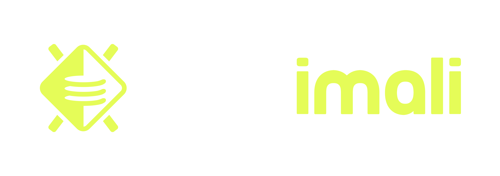

# Tata-iMali - Revolutionizing Micro-Credit on Hedera



## Table of Contents

- [Introduction](#introduction)
- [Key Features](#key-features)
- [Getting Started](#getting-started)
  - [Dependencies](#dependencies)
  - [Installation](#installation)
  - [Running the Program](#running-the-program)
- [License](#license)

## Introduction

Welcome to Tata-iMali, a pioneering financial technology platform built on the Hedera network. Our mission is to revolutionize micro-credit by leveraging blockchain technology, ensuring efficient, transparent, and secure micro-credit services. We empower lower-income individuals in Africa to overcome unforeseen expenses. What sets Tata-iMali apart is its use of advanced machine learning algorithms for credit prediction. These algorithms enable us to predict credit scores for users without formal credit histories, ensuring that even individuals with limited financial records can access the micro-credit they need to thrive.

## Key Features

- **Hedera-Powered Micro-Credit**: Tata-iMali utilizes the capabilities of the Hedera network to offer a blockchain-based micro-credit platform, ensuring trust, affordability, speed, transparency, and security in financial transactions.

- **Innovative Lending Algorithms**: Tata-iMali employs cutting-edge machine learning techniques, including scikit-learn and TensorFlow, to assess creditworthiness. We analyze a variety of mobile usage data factors to predict credit scores, making financial services more accessible to all.

- **Financial Inclusion**: Tata-iMali is committed to promoting financial inclusion by extending credit services to underserved and unbanked populations, fostering economic growth worldwide.

- **User-Friendly Interface**: We provide a user-friendly interface for both lenders and borrowers, ensuring a seamless and accessible financial experience.

- **Security and Decentralization**: With Hedera's decentralized infrastructure, Tata-iMali ensures the highest level of security for all financial activities while minimizing central points of failure.

- **MTN Integration**: Tata-iMali seamlessly integrates with major African telecoms provider MTN's open API to obtain KYC (Know Your Customer) information and enables users to exchange the iMali-ZAR stablecoin for mobile money within the mobile money ecosystem.

## Dependencies

All project dependencies have been thoughtfully documented in the `package.json` file.

## Installation

Follow these steps to install the required dependencies:

1. Open your terminal.

2. Navigate to the root directory of your project.

3. To install, run the following command:

```shell
npm install
```

## Running the Program

Once you have installed dependancies, you may start the program. To start the program, follow these steps:

- Open your terminal.
- Navigate to the root directory of your project.
- Run the following command to start the program:

```shell
npm start
```

This command will initiate the necessary processes, and your program will start running.

Note: Make sure you have satisfied all the prerequisites and dependencies before running the program.

## License

The code submitted herewith is the proprietary and confidential intellectual property of Tata-iMali. It is provided solely for the purpose of evaluation and review by authorized representatives of the Hashgraph Association and the Swiss Digital Asset Institute. Unauthorized access, distribution, or sharing of this code is strictly prohibited.

By accessing and reviewing this code, you, as an authorized representative of the Hashgraph Association and the Swiss Digital Asset Institute, agree to the following:

You are an authorized representative involved with the grant review process of the Hashgraph Association and the Swiss Digital Asset Institute.

You will maintain the confidentiality of the code and will not share, distribute, or use it for any purpose other than the grant review.

Your access to and review of this code does not grant you any rights, licenses, or permissions to use, modify, or distribute the code for any other purpose.

Your cooperation and adherence to these terms are greatly appreciated.


